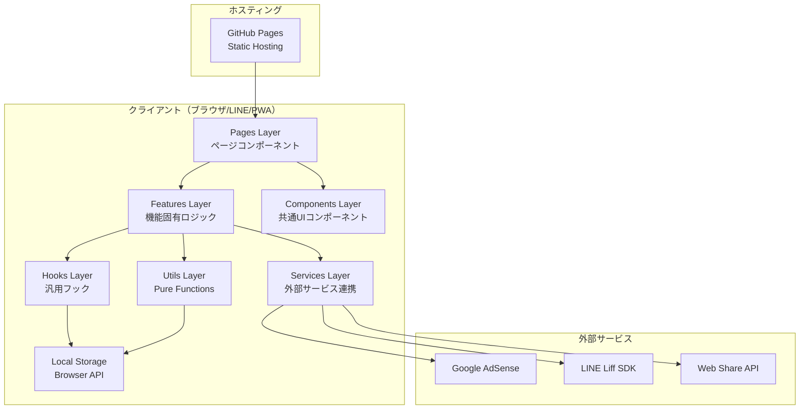

# 02_architecture.md - アーキテクチャ設計書

## 1. システム全体像

### 1.1 アーキテクチャ概要



### 1.2 アーキテクチャパターン

#### レイヤー構成
- **Pages Layer**：ルーティング対応、データ取得・状態管理を担当
- **Features Layer**：機能固有のロジック・UIコンポーネント
- **Components Layer**：再利用可能な汎用UIコンポーネント（Pure）
- **Services Layer**：外部サービス連携の抽象化
- **Hooks Layer**：汎用的なカスタムフック
- **Utils Layer**：純粋関数（副作用なし）

#### その他のパターン
- **SPA（Single Page Application）**
- **データ永続化**：localStorage（クライアントサイド）
- **スキーマ駆動**：Zodによる型定義・バリデーション

## 2. ディレクトリ構成

```
symbol-hit-and-blow/
├── public/
│   ├── index.html
│   ├── manifest.json          # PWA用マニフェスト
│   ├── robots.txt
│   ├── icons/                 # PWAアイコン各サイズ
│   │   ├── icon-192.png
│   │   └── icon-512.png
│   └── assets/                # 静的アセット
│       └── tiles/             # SVGタイル
│           ├── star.svg
│           ├── circle.svg
│           ├── triangle.svg
│           ├── square.svg
│           ├── diamond.svg
│           ├── spade.svg
│           ├── heart.svg
│           └── club.svg
├── src/
│   ├── main.tsx               # エントリーポイント
│   ├── App.tsx                # ルートコンポーネント
│   ├── AppRouter.tsx          # ルーティング設定
│   ├── vite-env.d.ts
│   ├── components/            # 共通UIコンポーネント（Pure）
│   │   ├── Button/
│   │   │   └── Button.tsx
│   │   ├── Modal/
│   │   │   └── Modal.tsx
│   │   ├── Loading/
│   │   │   └── Loading.tsx
│   │   └── Card/
│   │       └── Card.tsx
│   ├── features/              # 機能固有のコンポーネント・ロジック
│   │   ├── game/              # ゲーム機能
│   │   │   ├── game.schema.ts
│   │   │   ├── useGame.ts
│   │   │   ├── gameLogic.ts
│   │   │   ├── GameBoard/
│   │   │   │   └── GameBoard.tsx
│   │   │   ├── GameHeader/
│   │   │   │   └── GameHeader.tsx
│   │   │   ├── TilePicker/
│   │   │   │   └── TilePicker.tsx
│   │   │   ├── GuessHistory/
│   │   │   │   └── GuessHistory.tsx
│   │   │   └── ResultDisplay/
│   │   │       └── ResultDisplay.tsx
│   │   ├── stats/             # 統計機能
│   │   │   ├── stats.schema.ts
│   │   │   ├── useStats.ts
│   │   │   └── StatsPanel/
│   │   │       └── StatsPanel.tsx
│   │   ├── tutorial/          # チュートリアル機能
│   │   │   ├── useTutorial.ts
│   │   │   ├── TutorialModal/
│   │   │   │   └── TutorialModal.tsx
│   │   │   └── TutorialStep/
│   │   │       └── TutorialStep.tsx
│   │   ├── share/             # シェア機能
│   │   │   ├── useShare.ts
│   │   │   ├── shareHelper.ts
│   │   │   ├── ShareButton/
│   │   │   │   └── ShareButton.tsx
│   │   │   └── ResultImage/
│   │   │       └── ResultImage.tsx
│   │   └── ad/                # 広告機能
│   │       └── AdBanner/
│   │           └── AdBanner.tsx
│   ├── services/              # 外部サービス連携
│   │   ├── liff/
│   │   │   └── useLiff.ts
│   │   └── storage/
│   │       └── useLocalStorage.ts
│   ├── hooks/                 # 汎用カスタムフック
│   │   ├── useDarkMode.ts
│   │   └── useMediaQuery.ts
│   ├── utils/                 # ユーティリティ関数
│   │   ├── randomGenerator.ts
│   │   └── imageGenerator.ts
│   ├── consts/                # 定数定義
│   │   ├── tiles.ts
│   │   ├── modes.ts
│   │   ├── playTypes.ts
│   │   ├── languages.ts
│   │   ├── themes.ts
│   │   ├── config.ts
│   │   └── storageKeys.ts
│   ├── i18n/                  # 国際化
│   │   ├── index.ts
│   │   ├── i18n.schema.ts
│   │   └── locales/
│   │       ├── ja.json
│   │       └── en.json
│   ├── pages/                 # ページコンポーネント
│   │   ├── HomePage.tsx
│   │   ├── GamePage.tsx
│   │   ├── StatsPage.tsx
│   │   └── TutorialPage.tsx
│   └── styles/                # グローバルスタイル
│       └── index.css
├── e2e/                       # E2Eテスト（Playwright）
│   └── game.spec.ts
├── .github/
│   └── workflows/
│       └── deploy.yml
├── index.html
├── vite.config.ts
├── tailwind.config.js
├── tsconfig.json
├── eslint.config.js
├── .nvmrc
├── package.json
├── pnpm-lock.yaml
└── README.md
```

## 3. 技術スタック詳細

### 3.1 コア技術

| 技術 | バージョン | 用途 |
|------|-----------|------|
| React | 19.x | UIフレームワーク |
| TypeScript | 5.x | 型安全な開発 |
| Vite | 5.x | ビルドツール |
| Tailwind CSS | 3.x | スタイリング |
| pnpm | 11.x | パッケージマネージャー |

### 3.2 主要ライブラリ

[package.json](../package.json) を参照

### 3.3 ライブラリ選定理由

- **pnpm**：高速・ディスク効率的なパッケージマネージャー
- **react-router-dom**：SPA内でのページ遷移管理
- **react-i18next / i18next**：多言語対応（日本語・英語）
- **zod**：スキーマ定義・バリデーション・型推論
- **@liff/liff-sdk**：LINE Liff対応
- **html2canvas**：結果画面の画像生成
- **@playwright/test**：E2Eテスト

## 4. 定数定義（consts/）

### 4.1 tiles.ts

```typescript
// タイルID定数
export const TILE_IDS = {
  STAR: 'star',
  CIRCLE: 'circle',
  TRIANGLE: 'triangle',
  SQUARE: 'square',
  DIAMOND: 'diamond',
  SPADE: 'spade',
  HEART: 'heart',
  CLUB: 'club'
} as const;

// タイルID配列（Zod enum用）
export const TILE_ID_VALUES = Object.values(TILE_IDS);

// タイル定義（Tile型はgame.schemaから取得）
export const TILES = {
  [TILE_IDS.STAR]: { id: TILE_IDS.STAR, color: '#FBBF24', svgPath: '/assets/tiles/star.svg' },
  [TILE_IDS.CIRCLE]: { id: TILE_IDS.CIRCLE, color: '#EF4444', svgPath: '/assets/tiles/circle.svg' },
  [TILE_IDS.TRIANGLE]: { id: TILE_IDS.TRIANGLE, color: '#3B82F6', svgPath: '/assets/tiles/triangle.svg' },
  [TILE_IDS.SQUARE]: { id: TILE_IDS.SQUARE, color: '#10B981', svgPath: '/assets/tiles/square.svg' },
  [TILE_IDS.DIAMOND]: { id: TILE_IDS.DIAMOND, color: '#8B5CF6', svgPath: '/assets/tiles/diamond.svg' },
  [TILE_IDS.SPADE]: { id: TILE_IDS.SPADE, color: '#1F2937', svgPath: '/assets/tiles/spade.svg' },
  [TILE_IDS.HEART]: { id: TILE_IDS.HEART, color: '#EC4899', svgPath: '/assets/tiles/heart.svg' },
  [TILE_IDS.CLUB]: { id: TILE_IDS.CLUB, color: '#F97316', svgPath: '/assets/tiles/club.svg' }
} as const;

// タイル配列
export const AVAILABLE_TILES = Object.values(TILES);
```

### 4.2 modes.ts

```typescript
// ゲームモードID定数
export const GAME_MODE_IDS = {
  BEGINNER: 'beginner',
  NORMAL: 'normal',
  HARD: 'hard',
  EXPERT: 'expert',
  MASTER: 'master'
} as const;

// ゲームモードID配列（Zod enum用）
export const GAME_MODE_ID_VALUES = Object.values(GAME_MODE_IDS);

// ゲームモード設定（ModeConfig型はgame.schemaから取得）
export const GAME_MODES = {
  [GAME_MODE_IDS.BEGINNER]: {
    id: GAME_MODE_IDS.BEGINNER,
    nameKey: 'mode.beginner',
    length: 3,
    allowDuplicates: false,
    maxAttempts: 6
  },
  [GAME_MODE_IDS.NORMAL]: {
    id: GAME_MODE_IDS.NORMAL,
    nameKey: 'mode.normal',
    length: 4,
    allowDuplicates: false,
    maxAttempts: 8
  },
  [GAME_MODE_IDS.HARD]: {
    id: GAME_MODE_IDS.HARD,
    nameKey: 'mode.hard',
    length: 4,
    allowDuplicates: true,
    maxAttempts: 10
  },
  [GAME_MODE_IDS.EXPERT]: {
    id: GAME_MODE_IDS.EXPERT,
    nameKey: 'mode.expert',
    length: 8,
    allowDuplicates: false,
    maxAttempts: 12,
    unlockCondition: GAME_MODE_IDS.NORMAL
  },
  [GAME_MODE_IDS.MASTER]: {
    id: GAME_MODE_IDS.MASTER,
    nameKey: 'mode.master',
    length: 8,
    allowDuplicates: true,
    maxAttempts: 15,
    unlockCondition: GAME_MODE_IDS.EXPERT
  }
} as const;
```

### 4.3 playTypes.ts

```typescript
// プレイタイプID定数
export const PLAY_TYPE_IDS = {
  FREE: 'free',
  DAILY: 'daily'
} as const;

// プレイタイプID配列（Zod enum用）
export const PLAY_TYPE_ID_VALUES = Object.values(PLAY_TYPE_IDS);
```

### 4.4 languages.ts

```typescript
// 言語ID定数
export const LANGUAGE_IDS = {
  JA: 'ja',
  EN: 'en'
} as const;

// 言語ID配列（Zod enum用）
export const LANGUAGE_ID_VALUES = Object.values(LANGUAGE_IDS);
```

### 4.5 themes.ts

```typescript
// テーマID定数
export const THEME_IDS = {
  LIGHT: 'light',
  DARK: 'dark',
  SYSTEM: 'system'
} as const;

// テーマID配列（Zod enum用）
export const THEME_ID_VALUES = Object.values(THEME_IDS);
```

### 4.6 storageKeys.ts

```typescript
// localStorage キー定数
export const STORAGE_KEYS = {
  STATS: 'tile-hab-stats',
  SETTINGS: 'tile-hab-settings',
  DAILY_PLAYED: 'tile-hab-daily-played'
} as const;
```

### 4.7 config.ts

```typescript
// アプリ設定
export const APP_CONFIG = {
  NAME: 'シンボルヒットアンドブロー',
  VERSION: '1.0.0',
  REPOSITORY: 'https://github.com/your-username/symbol-hit-and-blow',
  LIFF_ID: import.meta.env.VITE_LIFF_ID || '',
  ADSENSE_CLIENT_ID: import.meta.env.VITE_ADSENSE_CLIENT_ID || '',
  ADSENSE_SLOT_ID: import.meta.env.VITE_ADSENSE_SLOT_ID || ''
} as const;
```

## 5. スキーマ設計（Zod）

### 5.1 game.schema.ts

```typescript
import { z } from 'zod';
import { TILE_ID_VALUES } from '@/consts/tiles';
import { GAME_MODE_ID_VALUES } from '@/consts/modes';
import { PLAY_TYPE_ID_VALUES } from '@/consts/playTypes';

// Tile スキーマ
export const TileSchema = z.object({
  id: z.enum(TILE_ID_VALUES as [string, ...string[]]),
  color: z.string(),
  svgPath: z.string()
});

// GameMode スキーマ
export const GameModeSchema = z.enum(GAME_MODE_ID_VALUES as [string, ...string[]]);

// PlayType スキーマ
export const PlayTypeSchema = z.enum(PLAY_TYPE_ID_VALUES as [string, ...string[]]);

// Guess スキーマ
export const GuessSchema = z.object({
  tiles: z.array(TileSchema),
  hits: z.number().int().min(0),
  blows: z.number().int().min(0),
  timestamp: z.number().int().positive()
});

// GameState スキーマ
export const GameStateSchema = z.object({
  mode: GameModeSchema,
  playType: PlayTypeSchema,
  answer: z.array(TileSchema),
  guesses: z.array(GuessSchema),
  currentGuess: z.array(TileSchema),
  isGameOver: z.boolean(),
  isWon: z.boolean(),
  attempts: z.number().int().min(0),
  maxAttempts: z.number().int().min(1)
});

// GameResult スキーマ
export const GameResultSchema = z.object({
  mode: GameModeSchema,
  playType: PlayTypeSchema,
  isWon: z.boolean(),
  attempts: z.number().int().min(1),
  timestamp: z.number().int().positive()
});

// ModeConfig スキーマ
export const ModeConfigSchema = z.object({
  id: GameModeSchema,
  nameKey: z.string(),
  length: z.number().int().min(1),
  allowDuplicates: z.boolean(),
  maxAttempts: z.number().int().min(1),
  unlockCondition: GameModeSchema.optional()
});

// 型推論
export type Tile = z.output<typeof TileSchema>;
export type GameMode = z.output<typeof GameModeSchema>;
export type PlayType = z.output<typeof PlayTypeSchema>;
export type Guess = z.output<typeof GuessSchema>;
export type GameState = z.output<typeof GameStateSchema>;
export type GameResult = z.output<typeof GameResultSchema>;
export type ModeConfig = z.output<typeof ModeConfigSchema>;

// Input/Output型
export type TileInput = z.input<typeof TileSchema>;
export type TileOutput = z.output<typeof TileSchema>;
export type GameResultInput = z.input<typeof GameResultSchema>;
export type GameResultOutput = z.output<typeof GameResultSchema>;
```

### 5.2 stats.schema.ts

```typescript
import { z } from 'zod';
import { GameModeSchema } from '@/features/game/game.schema';

// ModeStats スキーマ
export const ModeStatsSchema = z.object({
  plays: z.number().int().min(0),
  wins: z.number().int().min(0),
  winRate: z.number().min(0).max(100),
  averageAttempts: z.number().min(0),
  bestAttempts: z.number().int().min(0)
});

// DailyRecord スキーマ
export const DailyRecordSchema = z.object({
  date: z.string().regex(/^\d{4}-\d{2}-\d{2}$/),
  mode: GameModeSchema,
  isWon: z.boolean(),
  attempts: z.number().int().min(1)
});

// Stats スキーマ
export const StatsSchema = z.object({
  version: z.string().default('1.0'),
  totalPlays: z.number().int().min(0).default(0),
  totalWins: z.number().int().min(0).default(0),
  winRate: z.number().min(0).max(100).default(0),
  averageAttempts: z.number().min(0).default(0),
  bestAttempts: z.number().int().min(0).default(0),
  modeStats: z.record(GameModeSchema, ModeStatsSchema).default({}),
  unlockedModes: z.array(GameModeSchema).default(['beginner', 'normal', 'hard']),
  dailyHistory: z.array(DailyRecordSchema).max(7).default([]),
  lastPlayed: z.string().default('')
});

// 型推論
export type ModeStats = z.output<typeof ModeStatsSchema>;
export type DailyRecord = z.output<typeof DailyRecordSchema>;
export type Stats = z.output<typeof StatsSchema>;

// Input/Output型
export type StatsInput = z.input<typeof StatsSchema>;
export type StatsOutput = z.output<typeof StatsSchema>;
```

### 5.3 i18n.schema.ts

```typescript
import { z } from 'zod';
import { LANGUAGE_ID_VALUES } from '@/consts/languages';
import { THEME_ID_VALUES } from '@/consts/themes';

// Settings スキーマ
export const SettingsSchema = z.object({
  language: z.enum(LANGUAGE_ID_VALUES as [string, ...string[]]).default('ja'),
  theme: z.enum(THEME_ID_VALUES as [string, ...string[]]).default('system'),
  soundEnabled: z.boolean().default(true),
  tutorialCompleted: z.boolean().default(false)
});

// 型推論
export type Settings = z.output<typeof SettingsSchema>;

// Input/Output型
export type SettingsInput = z.input<typeof SettingsSchema>;
export type SettingsOutput = z.output<typeof SettingsSchema>;
```

## 6. 主要コンポーネント設計

### 6.1 Pages Layer

#### GamePage.tsx
```typescript
import type { GameMode, PlayType } from '@/features/game/game.schema';

export function GamePage() {
  const { mode, playType } = useParams<{ mode: GameMode; playType: PlayType }>();
  const { /* ゲーム状態 */ } = useGame(mode, playType);
  const { shareText } = useShare();
  const { recordGame } = useStats();

  // （略：ゲーム終了時の処理）

  return (
    <div>
      <GameHeader /* props */ />
      <GameBoard /* props */ />
      {isGameOver && <ResultDisplay /* props */ />}
      <AdBanner />
    </div>
  );
}
```

#### StatsPage.tsx
```typescript
export function StatsPage() {
  const { stats, clearStats } = useStats();
  
  return <StatsPanel stats={stats} onClear={clearStats} />;
}
```

#### HomePage.tsx
```typescript
export function HomePage() {
  const { t } = useTranslation();
  const { unlockedModes } = useStats();
  
  // （略：モード選択UI）
  
  return (/* 略 */);
}
```

### 6.2 Features Layer

#### features/game/useGame.ts
```typescript
import type { GameMode, PlayType, Tile, Guess } from './game.schema';

export function useGame(mode: GameMode, playType: PlayType) {
  // 戻り値の型
  return {
    answer: Tile[],
    guesses: Guess[],
    currentGuess: Tile[],
    isGameOver: boolean,
    isWon: boolean,
    attempts: number,
    maxAttempts: number,
    submitGuess: () => void,
    updateCurrentGuess: (tile: Tile) => void,
    resetGame: () => void
  };
}
```

#### features/game/gameLogic.ts
```typescript
import type { Tile, Guess } from './game.schema';

// 答え生成（Pure Function）
export function generateAnswer(
  length: number,
  allowDuplicates: boolean,
  seed?: string
): Tile[] {
  // （略）
}

// ヒット・ブロー判定（Pure Function）
export function checkGuess(
  guess: Tile[],
  answer: Tile[]
): { hits: number; blows: number } {
  // （略）
}

// ゲーム終了判定（Pure Function）
export function isGameFinished(
  guesses: Guess[],
  maxAttempts: number,
  answerLength: number
): { isFinished: boolean; isWon: boolean } {
  // （略）
}
```

#### features/game/GameBoard/GameBoard.tsx
```typescript
import type { Guess, Tile } from '@/features/game/game.schema';

type GameBoardProps = {
  guesses: Guess[];
  currentGuess: Tile[];
  onTileSelect: (tile: Tile) => void;
  onSubmit: () => void;
  isGameOver: boolean;
};

export function GameBoard(props: GameBoardProps) {
  // （略）
}
```

#### features/game/TilePicker/TilePicker.tsx
```typescript
import type { Tile } from '@/features/game/game.schema';

type TilePickerProps = {
  selected: Tile[];
  onSelect: (tile: Tile) => void;
  maxLength?: number;
  disabled?: boolean;
};

export function TilePicker(props: TilePickerProps) {
  // （略）
}
```

#### features/stats/useStats.ts
```typescript
import type { Stats } from './stats.schema';
import type { GameResult, GameMode } from '@/features/game/game.schema';

export function useStats() {
  return {
    stats: Stats,
    recordGame: (result: GameResult) => void,
    unlockMode: (mode: GameMode) => void,
    clearStats: () => void
  };
}
```

#### features/share/useShare.ts
```typescript
import type { GameMode } from '@/features/game/game.schema';

export function useShare() {
  return {
    canShare: boolean,
    shareText: (data: { mode: GameMode; attempts: number }) => Promise<void>,
    shareImage: (canvas: HTMLCanvasElement) => Promise<void>
  };
}
```

#### features/share/shareHelper.ts
```typescript
import type { GameMode } from '@/features/game/game.schema';

// シェアテキスト生成（Pure Function）
export function generateShareText(data: { mode: GameMode; attempts: number }): string {
  // （略）
}

// 英語版シェアテキスト生成（Pure Function）
export function generateShareTextEn(data: { mode: GameMode; attempts: number }): string {
  // （略）
}
```

### 6.3 Services Layer

#### services/storage/useLocalStorage.ts
```typescript
import type { z } from 'zod';

export function useLocalStorage<T>(
  key: string,
  initialValue: T,
  schema?: z.ZodSchema<T>
): [T, (value: T | ((prev: T) => T)) => void, () => void] {
  // （略：localStorage の読み書き、Zodバリデーション）
}
```

#### services/liff/useLiff.ts
```typescript
type LiffProfile = {
  userId: string;
  displayName: string;
  pictureUrl?: string;
};

export function useLiff() {
  return {
    isLiff: boolean,
    isReady: boolean,
    profile: LiffProfile | null,
    shareToLine: (message: string) => Promise<void>
  };
}
```

### 6.4 Components Layer（Pure UI）

#### components/Button/Button.tsx
```typescript
type ButtonProps = {
  children: React.ReactNode;
  onClick?: () => void;
  disabled?: boolean;
  variant?: 'primary' | 'secondary' | 'danger';
  className?: string;
};

export function Button(props: ButtonProps) {
  // （略）
}
```

#### components/Modal/Modal.tsx
```typescript
type ModalProps = {
  isOpen: boolean;
  onClose: () => void;
  children: React.ReactNode;
  title?: string;
};

export function Modal(props: ModalProps) {
  // （略）
}
```

#### components/Loading/Loading.tsx
```typescript
export function Loading() {
  // （略）
}
```

### 6.5 Utils Layer

#### utils/randomGenerator.ts
```typescript
// デイリーシード生成（Pure Function）
export function getDailySeed(): string {
  // （略）
}

// シード付き乱数生成器（Pure Function）
export function createSeededRandom(seed: string) {
  // （略）
}
```

#### utils/imageGenerator.ts
```typescript
// HTML要素から画像生成
export async function generateResultImage(element: HTMLElement): Promise<HTMLCanvasElement> {
  // （略）
}

// Canvas to Blob変換
export function canvasToBlob(canvas: HTMLCanvasElement): Promise<Blob> {
  // （略）
}
```

### 6.6 Hooks Layer

#### hooks/useDarkMode.ts
```typescript
export function useDarkMode() {
  return {
    isDark: boolean,
    toggle: () => void,
    setDark: (dark: boolean) => void
  };
}
```

#### hooks/useMediaQuery.ts
```typescript
export function useMediaQuery(query: string): boolean {
  // （略）
}
```

## 7. 国際化（i18n）設計

### 7.1 初期化（i18n/index.ts）

```typescript
import i18n from 'i18next';
import { initReactI18next } from 'react-i18next';
import { LANGUAGE_IDS } from '@/consts/languages';
import ja from './locales/ja.json';
import en from './locales/en.json';

i18n
  .use(initReactI18next)
  .init({
    resources: {
      [LANGUAGE_IDS.JA]: { translation: ja },
      [LANGUAGE_IDS.EN]: { translation: en }
    },
    lng: LANGUAGE_IDS.JA,
    fallbackLng: LANGUAGE_IDS.JA,
    interpolation: { escapeValue: false }
  });

export default i18n;
```

### 7.2 翻訳ファイル例

```json
// i18n/locales/ja.json
{
  "common": {
    "title": "シンボルヒットアンドブロー",
    "start": "スタート",
    "restart": "もう一度",
    "back": "戻る"
  },
  "mode": {
    "beginner": "ビギナー",
    "normal": "ノーマル",
    "hard": "ハード",
    "expert": "エキスパート",
    "master": "マスター",
    "locked": "🔒 {{condition}}をクリアで解放"
  },
  "game": {
    "submit": "回答する",
    "attempts": "{{current}} / {{max}}回目",
    "hit": "ヒット",
    "blow": "ブロー"
  },
  "result": {
    "win": "クリア！",
    "lose": "ゲームオーバー",
    "attempts": "{{count}}回でクリア",
    "share": "シェアする",
    "restart": "もう一度プレイ"
  },
  "stats": {
    "title": "統計",
    "totalPlays": "総プレイ回数",
    "winRate": "クリア率",
    "avgAttempts": "平均クリア回数",
    "bestAttempts": "最短クリア回数",
    "clear": "統計をクリア"
  }
}
```

```json
// i18n/locales/en.json
{
  "common": {
    "title": "Symbol Hit & Blow",
    "start": "Start",
    "restart": "Restart",
    "back": "Back"
  },
  "mode": {
    "beginner": "Beginner",
    "normal": "Normal",
    "hard": "Hard",
    "expert": "Expert",
    "master": "Master",
    "locked": "🔒 Clear {{condition}} to unlock"
  },
  "game": {
    "submit": "Submit",
    "attempts": "Attempt {{current}} / {{max}}",
    "hit": "Hit",
    "blow": "Blow"
  },
  "result": {
    "win": "You Win!",
    "lose": "Game Over",
    "attempts": "Cleared in {{count}} attempts",
    "share": "Share",
    "restart": "Play Again"
  },
  "stats": {
    "title": "Statistics",
    "totalPlays": "Total Plays",
    "winRate": "Win Rate",
    "avgAttempts": "Avg. Attempts",
    "bestAttempts": "Best Attempts",
    "clear": "Clear Statistics"
  }
}
```

## 8. ビルド・デプロイ設計

### 8.1 Vite設定

```typescript
// vite.config.ts
import { defineConfig } from 'vite';
import react from '@vitejs/plugin-react';
import path from 'path';

export default defineConfig({
  plugins: [react()],
  resolve: {
    alias: {
      '@': path.resolve(__dirname, './src')
    }
  },
  base: '/symbol-hit-and-blow/',
  build: {
    outDir: 'dist',
    sourcemap: true,
    rollupOptions: {
      output: {
        manualChunks: {
          vendor: ['react', 'react-dom', 'react-router-dom'],
          i18n: ['react-i18next', 'i18next'],
          utils: ['html2canvas', 'zod']
        }
      }
    }
  }
});
```

### 8.2 pnpm設定

<!-- （略） -->

### 8.3 環境変数

```bash
# .env.example
VITE_LIFF_ID=your-liff-id
VITE_ADSENSE_CLIENT_ID=ca-pub-xxxxxxxxxx
VITE_ADSENSE_SLOT_ID=xxxxxxxxxx
```

### 8.4 GitHub Actions

<!-- （略） -->

## 9. パフォーマンス最適化

### 9.1 Code Splitting

```typescript
// AppRouter.tsx
import { lazy, Suspense } from 'react';
import { BrowserRouter, Routes, Route } from 'react-router-dom';
import { Loading } from '@/components/Loading/Loading';

const HomePage = lazy(() => import('@/pages/HomePage'));
const GamePage = lazy(() => import('@/pages/GamePage'));
const StatsPage = lazy(() => import('@/pages/StatsPage'));

export function AppRouter() {
  return (
    <BrowserRouter>
      <Suspense fallback={<Loading />}>
        <Routes>
          <Route path="/" element={<HomePage />} />
          <Route path="/game/:mode/:playType" element={<GamePage />} />
          <Route path="/stats" element={<StatsPage />} />
        </Routes>
      </Suspense>
    </BrowserRouter>
  );
}
```

### 9.2 メモ化

```typescript
import { memo } from 'react';

export const TilePicker = memo(function TilePicker(props: TilePickerProps) {
  // （略）
});
```

### 9.3 リソース最適化
- SVGタイルはインライン化（HTTPリクエスト削減）
- Tailwind CSSの未使用クラス除去（PurgeCSS）
- Viteのコード分割（vendor/utils別チャンク）

## 10. テスト戦略

### 10.1 E2Eテスト（Playwright）

```typescript
// e2e/game.spec.ts
import { test, expect } from '@playwright/test';

test('ゲームの基本フロー', async ({ page }) => {
  await page.goto('/');
  await page.click('text=ノーマル');
  // （略）
});

test('デイリーチャレンジ', async ({ page }) => {
  // （略）
});
```

## 11. 品質管理

### 11.1 TypeScript設定

```json
// tsconfig.json
{
  "compilerOptions": {
    "target": "ES2020",
    "lib": ["ES2020", "DOM", "DOM.Iterable"],
    "module": "ESNext",
    "moduleResolution": "bundler",
    "jsx": "react-jsx",
    "strict": true,
    "esModuleInterop": true,
    "skipLibCheck": true,
    "resolveJsonModule": true,
    "baseUrl": ".",
    "paths": {
      "@/*": ["./src/*"]
    }
  },
  "include": ["src"],
  "exclude": ["node_modules", "dist"]
}
```

### 11.2 ESLint設定

```javascript
// eslint.config.js
import js from '@eslint/js';
import typescript from '@typescript-eslint/eslint-plugin';
import react from 'eslint-plugin-react';

export default [
  js.configs.recommended,
  {
    files: ['**/*.{ts,tsx}'],
    plugins: { typescript, react },
    rules: {
      'react/react-in-jsx-scope': 'off',
      '@typescript-eslint/no-explicit-any': 'warn'
    }
  }
];
```

---

**作成日**：2025年1月
**バージョン**：4.0
