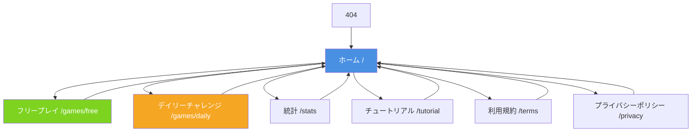
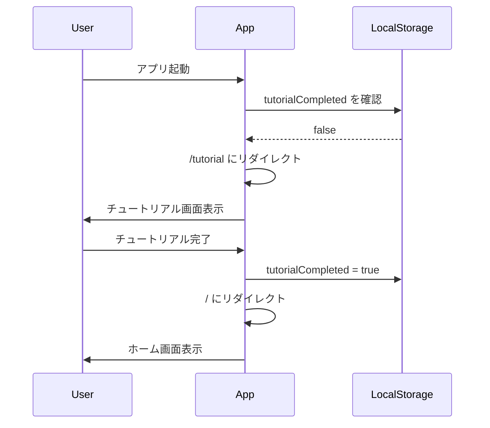

# サイトマップ設計書
---

## 目次

1. [概要](#概要)
2. [ページ一覧](#ページ一覧)
3. [ルーティング設計](#ルーティング設計)
4. [ページ詳細](#ページ詳細)
5. [ナビゲーション設計](#ナビゲーション設計)
6. [OGP設定](#ogp設定)
7. [404ページ](#404ページ)

---

## 概要

### サイト構成の方針

- **SPA（Single Page Application）**: React Router によるクライアントサイドルーティング
- **ルーティング方式**: パスパラメータ + クエリパラメータの組み合わせ
- **モーダル vs 独立ページ**:
  - **独立ページ**: チュートリアル、利用規約、プライバシーポリシー
  - **モーダル**: 設定
- **言語切替**: ヘッダー右上に常時表示（全ページ共通）

---

## ページ一覧

| # | ページ名 | パス | Phase | 説明 |
|---|---------|------|-------|------|
| 1 | ホーム | `/` | 1 | モード選択画面 |
| 2 | フリープレイ | `/games/free` | 1 | フリープレイのゲーム画面 |
| 3 | デイリーチャレンジ | `/games/daily` | 1 | デイリーチャレンジのゲーム画面 |
| 4 | 統計 | `/stats` | 1 | プレイ記録・統計表示 |
| 5 | チュートリアル | `/tutorial` | 1 | ゲームルール説明 |
| 6 | 利用規約 | `/terms` | 1 | 利用規約 |
| 7 | プライバシーポリシー | `/privacy` | 1 | プライバシーポリシー |
| 8 | 404 | `/404` or `*` | 1 | ページが見つからない |

**総ページ数**: 8ページ

---

## ルーティング設計

### ルーティング定義

```typescript
// src/routes.tsx
import { createBrowserRouter } from 'react-router-dom';

export const router = createBrowserRouter([
  {
    path: '/',
    element: <HomePage />,
  },
  {
    path: '/games/free',
    element: <GamePage playType="free" />,
  },
  {
    path: '/games/daily',
    element: <GamePage playType="daily" />,
  },
  {
    path: '/stats',
    element: <StatsPage />,
  },
  {
    path: '/tutorial',
    element: <TutorialPage />,
  },
  {
    path: '/terms',
    element: <TermsPage />,
  },
  {
    path: '/privacy',
    element: <PrivacyPage />,
  },
  {
    path: '*',
    element: <NotFoundPage />,
  },
], {
  basename: '/tile-hit-and-blow', // GitHub Pages用
});
```

### クエリパラメータ仕様

#### `/games/free?mode={mode}`

フリープレイのゲームモードを指定します。

| パラメータ | 型 | 必須 | デフォルト | 説明 |
|----------|-----|------|-----------|------|
| `mode` | `GameMode` | ❌ | `normal` | ゲームモード |

**有効な値**: `beginner`, `normal`, `hard`, `expert`, `master`

**例**:
```
/games/free → ノーマルモード（デフォルト）
/games/free?mode=beginner → ビギナーモード
/games/free?mode=hard → ハードモード
```

**不正な値の処理**:
- 未解放モード → ホーム画面にリダイレクト + トースト通知「このモードはまだ解放されていません」
- 存在しないモード → ノーマルモードにフォールバック

#### `/games/daily`

デイリーチャレンジは**ノーマルモード固定**のため、クエリパラメータはありません。

---

## ページ詳細

### 1. ホーム（`/`）

#### 目的
ゲームのエントリーポイント。モード選択とデイリーチャレンジへの導線。

#### 表示要素

**ヘッダー**:
- ゲームロゴ（左上）
- 言語切替ボタン（右上）`🌐 JA ▼`
- 設定ボタン（右上）`⚙️`

**メインコンテンツ**:
- ゲームタイトル（中央大きく）
- **チュートリアルボタン**（初回起動時のみ上部に大きく表示）
  - `tutorialCompleted === false` の場合のみ表示
  - 「はじめてプレイする方へ」などの訴求文付き
- **デイリーチャレンジボタン**（目立つデザイン・アイコン付き）
  - `📅 今日の問題に挑戦！`
  - プレイ済みの場合: `✅ 今日の問題（クリア済み）` などの表示
- **モード選択ボタン**（グリッドレイアウト）
  - ビギナー `⭐`
  - ノーマル `⭐⭐`
  - ハード `⭐⭐⭐`
  - エキスパート `⭐⭐⭐⭐` + 🔒（未解放時）
  - マスター `⭐⭐⭐⭐⭐` + 🔒（未解放時）
  - 各ボタンに「最高記録: X回」などの統計情報を表示（任意）

**フッター**:
- 統計ボタン `📊 統計を見る`
- チュートリアルボタン `❓ 遊び方`（常時表示）
- 利用規約リンク（小さく）
- プライバシーポリシーリンク（小さく）

#### 遷移先
- モード選択ボタン → `/games/free?mode={選択したモード}`
- デイリーチャレンジボタン → `/games/daily`
- 統計ボタン → `/stats`
- チュートリアルボタン → `/tutorial`
- 利用規約 → `/terms`
- プライバシーポリシー → `/privacy`

---

### 2. フリープレイ（`/games/free`）

#### 目的
選択したモードでフリープレイを行う。

#### 表示要素

**ヘッダー**:
- 戻るボタン（左上）`← ホーム`
- モード名表示（中央）`ノーマルモード`
- 言語切替ボタン（右上）
- 設定ボタン（右上）

**ゲームエリア**:
- 残り試行回数表示
- タイル選択UI（8種類のタイル）
- 推測履歴表示（タイル・ヒット・ブロー）
- 送信ボタン

**ゲーム終了後**:
- 結果表示（クリア/失敗）
- 試行回数・正解のタイル
- シェアボタン
- 広告表示（Google AdSense）
- 「もう一度プレイ」ボタン
- 「ホームに戻る」ボタン

#### 遷移元
- ホーム画面のモード選択ボタン

#### 遷移先
- 戻るボタン → `/`（確認ダイアログ表示）
- 「もう一度プレイ」 → 同じURL（ゲーム状態リセット）
- 「ホームに戻る」 → `/`

---

### 3. デイリーチャレンジ（`/games/daily`）

#### 目的
全ユーザー共通の日替わり問題に挑戦（1日1回のみ）。

#### 表示要素

**基本的にフリープレイと同じ**ですが、以下の違いがあります：

- **モード名表示**: `📅 今日の問題（ノーマル）`
- **プレイ済みチェック**: すでにプレイ済みの場合、結果画面を表示
  - 「今日の問題はすでにプレイ済みです」
  - 今日の結果表示（試行回数・成功/失敗）
  - 「ホームに戻る」ボタン
- **シェア機能**: デイリー専用のシェアテキスト
  - 「タイルヒットアンドブロー 今日の問題 YYYY/MM/DD クリア！🎉」

#### 遷移元
- ホーム画面のデイリーチャレンジボタン

#### 遷移先
- 戻るボタン → `/`
- 「ホームに戻る」 → `/`

---

### 4. 統計（`/stats`）

#### 目的
プレイ記録・統計情報の表示。

#### 表示要素

**ヘッダー**:
- 戻るボタン（左上）`← ホーム`
- ページタイトル（中央）`統計`
- 言語切替ボタン（右上）
- 設定ボタン（右上）

**統計情報**:
- **全体統計**（セクション）
  - 総プレイ回数
  - 総勝利数
  - 勝率
  - 平均試行回数
  - 最短試行回数
- **モード別統計**（タブ or アコーディオン）
  - 各モードのプレイ回数・勝率・平均試行回数など
- **デイリー履歴**（最大30日分）
  - カレンダー表示 or リスト表示
  - 日付・結果（成功/失敗）・試行回数

**フッター**:
- 「統計をクリア」ボタン（確認ダイアログ付き）

#### 遷移元
- ホーム画面の統計ボタン
- ヘッダーの統計リンク（将来追加の可能性）

#### 遷移先
- 戻るボタン → `/`

---

### 5. チュートリアル（`/tutorial`）

#### 目的
ゲームルール・操作方法の説明。

#### 表示要素

**ヘッダー**:
- 戻るボタン（左上）`← ホーム` or `× 閉じる`
- ページタイトル（中央）`遊び方`
- 言語切替ボタン（右上）

**コンテンツ**:
- **ステップ形式**（3〜5画面）:
  1. ゲームの目的（タイルの並びを推理）
  2. ヒット・ブローの説明（図解付き）
  3. タイルの種類紹介（8種類のアイコン）
  4. モード・プレイタイプの説明
  5. 実際に試してみよう（簡易ゲーム体験）

- **ページネーション**: 「次へ」「前へ」ボタン
- **スキップボタン**: 「スキップしてホームへ」

**初回起動時の挙動**:
- `tutorialCompleted === false` の場合、ホーム画面読み込み後に自動で `/tutorial` にリダイレクト
- チュートリアル完了後、`tutorialCompleted = true` に更新してホームへ遷移

#### 遷移元
- ホーム画面のチュートリアルボタン
- 初回起動時の自動リダイレクト

#### 遷移先
- 「完了」ボタン → `/`
- 戻るボタン → `/`

---

### 6. 利用規約（`/terms`）

#### 目的
サービス利用における規約の明示。

#### 表示要素

**ヘッダー**:
- 戻るボタン（左上）
- ページタイトル（中央）`利用規約`
- 言語切替ボタン（右上）

**コンテンツ**:
- **簡易版の利用規約**（Markdown形式）
  - サービスの目的
  - 禁止事項（不正行為、迷惑行為など）
  - 免責事項
  - 規約の変更
  - 準拠法・管轄裁判所

#### 遷移元
- ホーム画面フッターのリンク
- 設定モーダル内のリンク（任意）

#### 遷移先
- 戻るボタン → `/`

---

### 7. プライバシーポリシー（`/privacy`）

#### 目的
個人情報の取り扱いに関する方針の明示（Google AdSense利用時は必須）。

#### 表示要素

**ヘッダー**:
- 戻るボタン（左上）
- ページタイトル（中央）`プライバシーポリシー`
- 言語切替ボタン（右上）

**コンテンツ**:
- **簡易版のプライバシーポリシー**（Markdown形式）
  - 収集する情報（localStorage、Cookie、Google AdSense）
  - 情報の利用目的
  - 第三者への提供（Google AdSense）
  - Cookieの使用
  - 個人情報の開示・訂正・削除
  - お問い合わせ先

#### 遷移元
- ホーム画面フッターのリンク
- 設定モーダル内のリンク（任意）

#### 遷移先
- 戻るボタン → `/`

---

### 8. 404ページ（`*`）

#### 目的
存在しないURLにアクセスした際のフォールバック。

#### 表示要素

**ヘッダー**:
- ゲームロゴ（左上）
- 言語切替ボタン（右上）

**メインコンテンツ**:
- エラーメッセージ（中央大きく）
  - `404 - ページが見つかりません`
  - `お探しのページは存在しないか、移動した可能性があります。`
- ホームに戻るボタン（大きく目立つ）

#### 遷移先
- ホームに戻るボタン → `/`

---

## ナビゲーション設計

### ヘッダー構成

全ページ共通のヘッダーレイアウト：

```
┌─────────────────────────────────────────┐
│ [ロゴ/戻る]    [ページタイトル]    [🌐 JA ▼] [⚙️] │
└─────────────────────────────────────────┘
```

**左側**:
- ホーム（`/`）: ゲームロゴ
- その他ページ: 戻るボタン `←`

**中央**:
- ページタイトル or モード名

**右側**:
- 言語切替ドロップダウン `🌐 JA ▼` or `🌐 EN ▼`
- 設定ボタン `⚙️`（ホームと統計のみ、他は任意）

### フッター構成

ホーム（`/`）のみフッター表示：

```
┌─────────────────────────────────────────┐
│         [📊 統計] [❓ 遊び方]              │
│     [利用規約] [プライバシーポリシー]       │
└─────────────────────────────────────────┘
```

### 設定モーダル

**トリガー**: ヘッダー右上の設定ボタン `⚙️`

**表示内容**:
- **テーマ設定**: ライト / ダーク / システム（ラジオボタン）
- **効果音**: ON / OFF（トグルスイッチ）
- **通知設定**: ON / OFF（トグルスイッチ）※Phase 1から表示
  - Phase 1: 「通知機能は準備中です」などの注釈を表示
  - Phase 2以降: 実際の通知設定として機能
- **リンク**:
  - 利用規約へのリンク
  - プライバシーポリシーへのリンク
- **閉じるボタン**

---

## OGP設定

### 基本方針
トップページ（`/`）のみOGP設定を行います。

### OGPタグ（`index.html`）

```html
<head>
  <!-- 基本情報 -->
  <meta property="og:type" content="website" />
  <meta property="og:url" content="https://yourdomain.github.io/tile-hit-and-blow/" />
  <meta property="og:title" content="タイルヒットアンドブロー | シンボル推理ゲーム" />
  <meta property="og:description" content="8種類のタイルを使った推理ゲーム。毎日新しい問題に挑戦しよう！" />
  <meta property="og:image" content="https://yourdomain.github.io/tile-hit-and-blow/ogp.png" />
  <meta property="og:site_name" content="タイルヒットアンドブロー" />
  <meta property="og:locale" content="ja_JP" />
  
  <!-- Twitter Card -->
  <meta name="twitter:card" content="summary_large_image" />
  <meta name="twitter:title" content="タイルヒットアンドブロー | シンボル推理ゲーム" />
  <meta name="twitter:description" content="8種類のタイルを使った推理ゲーム。毎日新しい問題に挑戦しよう！" />
  <meta name="twitter:image" content="https://yourdomain.github.io/tile-hit-and-blow/ogp.png" />
</head>
```

### OGP画像仕様
- **サイズ**: 1200×630px（推奨）
- **形式**: PNG or JPEG
- **内容**: ゲームロゴ + タイトル + タイルのビジュアル

---

## 404ページ

### ルーティング設定

React Routerの`*`パスで全ての未定義ルートをキャッチします。

```typescript
{
  path: '*',
  element: <NotFoundPage />,
}
```

### GitHub Pages対応

GitHub PagesはSPAのクライアントサイドルーティングに対応していないため、以下の対応が必要です：

#### `404.html`の作成

```html
<!DOCTYPE html>
<html lang="ja">
<head>
  <meta charset="UTF-8">
  <script>
    // GitHub Pages用のリダイレクト処理
    sessionStorage.setItem('redirectPath', location.pathname);
    location.replace('/tile-hit-and-blow/');
  </script>
</head>
<body></body>
</html>
```

#### `index.html`でのリダイレクト処理

```html
<script>
  // 404.htmlからのリダイレクトを処理
  (function() {
    const redirect = sessionStorage.getItem('redirectPath');
    if (redirect) {
      sessionStorage.removeItem('redirectPath');
      history.replaceState(null, null, redirect);
    }
  })();
</script>
```

---

## サイトマップ図



---

## 画面遷移フロー（初回起動時）



---

## Phase別実装範囲

### Phase 1（Web版・LINE Liff）
- ✅ 全8ページ実装
- ✅ 基本的なルーティング
- ✅ 言語切替（ヘッダー）
- ✅ 設定モーダル（通知設定は表示のみ）
- ✅ OGP設定

### Phase 2（PWA化）
- ✅ 通知設定の実際の機能実装
- ✅ Service Worker導入
- ✅ オフライン対応
- ✅ ホーム画面追加プロンプト

### Phase 3（ネイティブアプリ）
- ✅ ネイティブ通知
- ✅ アプリ内ナビゲーションの最適化

---

## 関連ドキュメント

- **01_requirements.md**: プロジェクト要件・ゲームルール
- **02_architecture.md**: アーキテクチャ設計・技術スタック
- **03_database.md**: localStorage設計・スキーマ
- **04_api.md**: 外部サービス連携設計

---

## 変更履歴

| バージョン | 日付 | 変更内容 |
|----------|------|---------|
| 1.0 | 2024-XX-XX | 初版作成 |